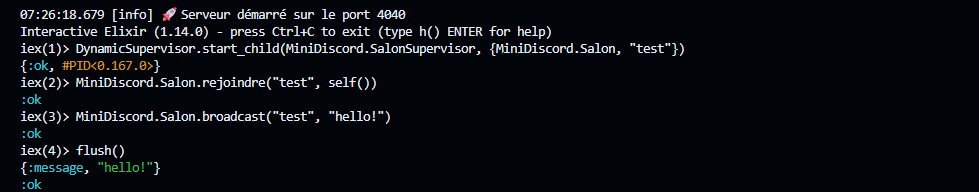
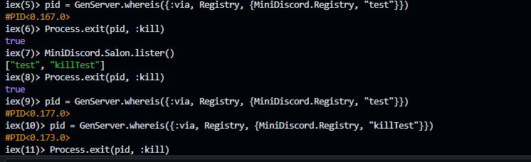
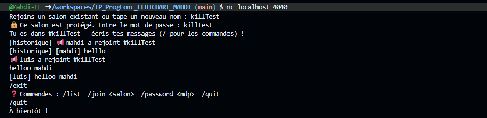
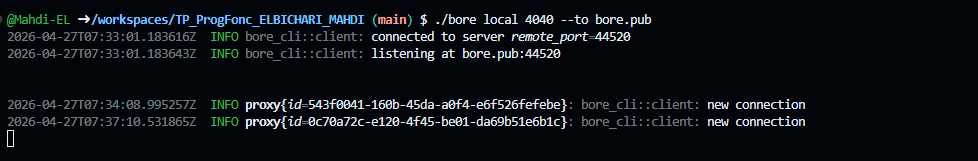
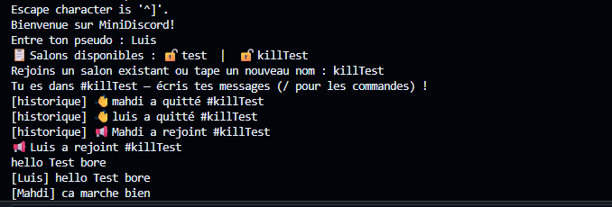

# MiniDiscord — TP Programmation Fonctionnelle
**Étudiant :** ELBICHARI Mahdi  
**Langage :** Elixir / OTP  
**Dépôt :** https://github.com/Mahdi-EL/TP_ProgFonc_ELBICHARI_MAHDI

---

## Arborescence du projet

```
TP_ProgFonc_ELBICHARI_MAHDI/
├── lib/
│   ├── chat_server.ex       ← Serveur TCP (accepte les connexions)
│   ├── client_handler.ex    ← Gestion de chaque client connecté
│   ├── mini_discord.ex      ← Application OTP + supervision
│   └── salon.ex             ← GenServer gérant un canal de discussion
├── test/
├── mix.exs                  ← Configuration du projet
└── README.md
```

---

## Installation et lancement

```bash
# 1. Vérifier qu'Elixir est installé
mix --version

# 2. Compiler le projet
mix compile

# 3. Lancer en mode interactif
iex -S mix
```

---

## Phase 1 — GenServer : le module Salon

### Code complété — `lib/salon.ex`

#### `handle_call({:rejoindre, pid})`
```elixir
def handle_call({:rejoindre, pid, password}, _from, state) do
  cond do
    state.password == nil ->
      {:reply, :ok, ajouter_client(pid, state)}
    password != nil and :crypto.hash(:sha256, password) == state.password ->
      {:reply, :ok, ajouter_client(pid, state)}
    true ->
      {:reply, {:error, :mauvais_password}, state}
  end
end
```

#### `handle_cast({:broadcast, msg})`
```elixir
def handle_cast({:broadcast, msg}, state) do
  Enum.each(state.clients, fn pid -> send(pid, {:message, msg}) end)
  nouvel_historique = Enum.take([msg | state.historique], 10)
  {:noreply, %{state | historique: nouvel_historique}}
end
```

#### `handle_info({:DOWN, ...})`
```elixir
def handle_info({:DOWN, _ref, :process, pid, _reason}, state) do
  nouveaux_clients = List.delete(state.clients, pid)
  {:noreply, %{state | clients: nouveaux_clients}}
end
```

#### `def lister` — Lister les salons actifs
```elixir
def lister do
  Registry.select(MiniDiscord.Registry, [{{:"$1", :_, :_}, [], [:"$1"]}])
end
```

---

### Réponses aux questions — Phase 1

**Q1. Pourquoi utilise-t-on `Process.monitor/1` dans `handle_call({:rejoindre})` ?**

`Process.monitor/1` permet au salon de surveiller chaque client abonné.
Si un client se déconnecte brutalement (coupure réseau, fermeture du terminal),
son processus se termine et OTP envoie automatiquement un message `{:DOWN, ref, :process, pid, reason}`
au salon. Sans ce mécanisme, les PIDs morts s'accumulent dans la liste `clients`
et le salon essaie de leur envoyer des messages indéfiniment → fuite mémoire.

---

**Q2. Que se passe-t-il si on n'implémente pas `handle_info({:DOWN, ...})` ?**

Sans ce callback, OTP envoie quand même le message `:DOWN` au GenServer
mais personne ne le traite. Cela génère un warning `handle_info/2 not handled`
et surtout, le PID mort reste dans `state.clients` pour toujours.
À chaque broadcast, le salon tente d'envoyer un message à ce PID fantôme :
`send/2` ne plante pas en Elixir, mais la liste grossit sans jamais se nettoyer
→ fuite mémoire progressive.

---

**Q3. Quelle est la différence entre `handle_call` et `handle_cast` ?
Pourquoi `broadcast` est un cast ?**

| | `handle_call` | `handle_cast` |
|---|---|---|
| Synchronisme | **Synchrone** — l'appelant attend la réponse | **Asynchrone** — l'appelant n'attend rien |
| Réponse | Obligatoire `{:reply, valeur, état}` | Aucune `{:noreply, état}` |
| Blocage | Oui, pendant le traitement | Non |

`broadcast` est un `cast` car l'émetteur du message n'a pas besoin de savoir
quand les abonnés l'ont reçu : il envoie et continue immédiatement.
Utiliser un `call` bloquerait le client le temps que le salon distribue le message
à tous ses abonnés, ce qui serait inutile et moins performant.
En revanche, `rejoindre` et `quitter` sont des `call` car on a besoin
de la confirmation `:ok` avant de continuer le flux de connexion.

---

### Test Phase 1 — Résultat



**Commandes exécutées :**
```elixir
DynamicSupervisor.start_child(MiniDiscord.SalonSupervisor, {MiniDiscord.Salon, "test"})
MiniDiscord.Salon.rejoindre("test", self())
MiniDiscord.Salon.broadcast("test", "hello!")
flush()   # => {:message, "hello!"}  ✅
```

---

## Phase 2 — Supervision et robustesse

### Arbre de supervision — `lib/mini_discord.ex`

```elixir
children = [
  {Registry, keys: :unique, name: MiniDiscord.Registry},
  {DynamicSupervisor, strategy: :one_for_one, name: MiniDiscord.SalonSupervisor},
  MiniDiscord.ChatServer,
  {Task.Supervisor, name: MiniDiscord.TaskSupervisor}
]
```

### Test — Tuer un processus et observer le redémarrage



**Commandes exécutées :**
```elixir
pid = GenServer.whereis({:via, Registry, {MiniDiscord.Registry, "test"}})
# => #PID<0.167.0>
Process.exit(pid, :kill)
# => true
MiniDiscord.Salon.lister()
# => ["test", "killTest"]
pid = GenServer.whereis({:via, Registry, {MiniDiscord.Registry, "test"}})
# => #PID<0.177.0>  ← nouveau PID ! ✅
```

**Observation :** Le PID est passé de `#PID<0.167.0>` à `#PID<0.177.0>` →
le `DynamicSupervisor` a automatiquement relancé le salon après le kill.

---

### Réponses aux questions — Phase 2

**Q2-4. Le salon redémarre-t-il après le kill ? Pourquoi ?**

**Oui**, le salon redémarre automatiquement, comme le prouve le changement de PID
(`#PID<0.167.0>` → `#PID<0.177.0>`).
Il est supervisé par `MiniDiscord.SalonSupervisor` (un `DynamicSupervisor`
avec la stratégie `:one_for_one`).
Quand un enfant meurt, le superviseur reçoit le signal de fin et en recrée
une nouvelle instance selon les paramètres de `start_link`.
C'est le principe fondamental de la tolérance aux pannes OTP : *let it crash*,
le superviseur gère la résurrection.

---

**Q2-5. Quelle est la différence entre `:one_for_one` et `:one_for_all` ?**

- **`:one_for_one`** : si un enfant plante, **seul cet enfant** est redémarré.
  Les autres continuent normalement. C'est la stratégie utilisée ici car
  les salons sont totalement indépendants les uns des autres.

- **`:one_for_all`** : si un enfant plante, **tous les enfants** sont arrêtés
  puis redémarrés ensemble. On l'utilise quand les processus sont fortement
  couplés et ne peuvent pas fonctionner sans les autres
  (ex : un processus de configuration dont tous les autres dépendent).

---

### Amélioration — Historique des messages

L'état du Salon a été enrichi :
```elixir
%{name: name, clients: [], historique: [], password: nil}
```

Les 10 derniers messages sont conservés et envoyés au nouveau client :
```elixir
# Dans handle_cast({:broadcast, msg}) :
nouvel_historique = Enum.take([msg | state.historique], 10)

# Dans ajouter_client/2 :
Enum.each(Enum.reverse(state.historique), fn msg ->
  send(pid, {:message, "[historique] #{msg}"})
end)
```

---

## Phase 3 — Sécurité et commandes

### 3.1 Pseudos uniques via ETS

Table ETS créée au démarrage dans `mini_discord.ex` :
```elixir
if :ets.whereis(:pseudos) == :undefined do
  :ets.new(:pseudos, [:named_table, :public, :set])
end
```

Fonctions dans `client_handler.ex` :
```elixir
defp pseudo_disponible?(pseudo), do: :ets.lookup(:pseudos, pseudo) == []
defp reserver_pseudo(pseudo),    do: :ets.insert(:pseudos, {pseudo, self()})
defp liberer_pseudo(pseudo),     do: :ets.delete(:pseudos, pseudo)
```

### 3.2 Commandes slash

| Commande | Effet |
|---|---|
| `/list` | Affiche les salons actifs avec 🔒/🔓 |
| `/join <salon>` | Quitte le salon actuel et rejoint un nouveau |
| `/password <mdp>` | Définit un mot de passe sur le salon actuel |
| `/quit` | Déconnecte proprement le client |
| autre | "Commande inconnue" |

### Test Phase 3 — Connexion et commandes



---

## Bonus — Authentification par mot de passe

### Implémentation

```elixir
# Dans l'état du Salon :
%{name: name, clients: [], historique: [], password: nil}

# Stocker le mot de passe hashé en SHA256 :
def handle_call({:set_password, password}, _from, state) do
  hashed = :crypto.hash(:sha256, password)
  {:reply, :ok, %{state | password: hashed}}
end

# Vérifier lors du rejoindre :
def handle_call({:rejoindre, pid, password}, _from, state) do
  cond do
    state.password == nil ->
      {:reply, :ok, ajouter_client(pid, state)}
    password != nil and :crypto.hash(:sha256, password) == state.password ->
      {:reply, :ok, ajouter_client(pid, state)}
    true ->
      {:reply, {:error, :mauvais_password}, state}
  end
end
```

### Test Bonus — Salon protégé + connexion distante via bore





**Ce qui est démontré :**
- Salon `killTest` créé avec mot de passe 🔒
- Liste des salons affichée avec `🔒 test | 🔒 killTest`
- Connexion depuis un PC distant via `bore.pub:44520`
- L'utilisateur `Luis` rejoint depuis une autre machine
- Messages en temps réel entre `Mahdi` et `Luis`
- Historique visible au nouveau client
- `/quit` déconnecte proprement

---

## Tunnel bore — Accès depuis n'importe quelle machine

```bash
# Installer bore
curl -L https://github.com/ekzhang/bore/releases/download/v0.5.0/bore-v0.5.0-x86_64-unknown-linux-musl.tar.gz | tar xz

# Lancer le tunnel
./bore local 4040 --to bore.pub
# => listening at bore.pub:44520

# Depuis n'importe quelle machine :
telnet bore.pub 44520
```

---

## Résumé — Tout ce qui a été implémenté

| Fonctionnalité | Fichier | Statut |
|---|---|---|
| GenServer Salon | `salon.ex` | ✅ |
| `Process.monitor` + `handle_info(:DOWN)` | `salon.ex` | ✅ |
| Historique 10 messages | `salon.ex` | ✅ |
| `def lister` avec `Registry.select` | `salon.ex` | ✅ |
| Supervision OTP | `mini_discord.ex` | ✅ |
| Table ETS pseudos uniques | `mini_discord.ex` + `client_handler.ex` | ✅ |
| Commandes `/list` `/join` `/quit` | `client_handler.ex` | ✅ |
| Mot de passe SHA256 (Bonus) | `salon.ex` + `client_handler.ex` | ✅ |
| Tunnel bore | — | ✅ |
| Test depuis machine distante | — | ✅ |
