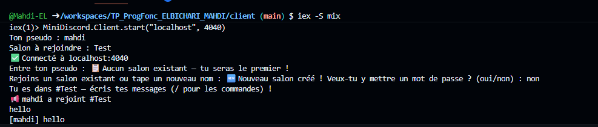
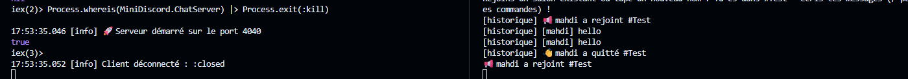
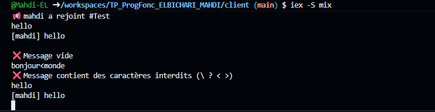
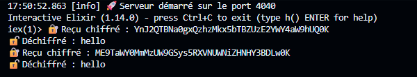
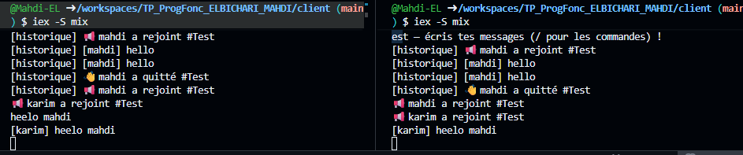

# MiniDiscord — Client TP Programmation Fonctionnelle
**Étudiant :** ELBICHARI Mahdi  
**Langage :** Elixir / OTP  
**Dépôt :** https://github.com/Mahdi-EL/TP_ProgFonc_ELBICHARI_MAHDI

---

## Arborescence du projet

```
client/
├── lib/
│   └── client.ex
├── test/
└── mix.exs
```

---

## Installation et lancement

```bash
# Compiler
mix compile

# Lancer
iex -S mix
```

```elixir
MiniDiscord.Client.start("localhost", 4040)
```

---

## Vérification des connexions

Avant d'implémenter le client complet, vérification manuelle dans iex :

```elixir
# Se connecter au serveur
{:ok, socket} = :gen_tcp.connect('localhost', 4040,
  [:binary, packet: :line, active: false])

# Lire le message de bienvenue
:gen_tcp.recv(socket, 0)

# Envoyer un pseudo
:gen_tcp.send(socket, "alice\r\n")

# Lire la suite
:gen_tcp.recv(socket, 0)
```

> **Remarque :** chaque ligne envoyée doit se terminer par `"\r\n"`

---

## 1. Client — Code complet

```elixir
defmodule MiniDiscord.Client do

  @cle "miniDiscordKey2025_SecretKey32!!"

  def start(host, port) do
    pseudo = IO.gets("Ton pseudo : ") |> String.trim()
    salon  = IO.gets("Salon à rejoindre : ") |> String.trim()
    connect_with_retry(host, port, pseudo, salon, 1)
  end

  defp connect_with_retry(host, port, pseudo, salon, attempt) do
    case :gen_tcp.connect(String.to_charlist(host), port,
           [:binary, packet: 0, active: false]) do
      {:ok, socket} ->
        IO.puts("✅ Connecté à #{host}:#{port}")
        handshake(socket, pseudo, salon)
        receiver = Task.async(fn -> receive_loop(socket, host, port, pseudo, salon) end)
        sender   = Task.async(fn -> send_loop(socket) end)
        Task.await(receiver, :infinity)
        Task.await(sender, :infinity)

      {:error, reason} ->
        IO.puts("⚠️ Tentative #{attempt} échouée : #{inspect(reason)}")
        :timer.sleep(2000)
        connect_with_retry(host, port, pseudo, salon, attempt + 1)
    end
  end

  defp handshake(socket, pseudo, salon) do
    :gen_tcp.recv(socket, 0, 500)
    :gen_tcp.send(socket, pseudo <> "\r\n")
    case :gen_tcp.recv(socket, 0, 500) do
      {:ok, msg} -> IO.write(msg)
      _ -> :ok
    end
    :gen_tcp.send(socket, salon <> "\r\n")
    attendre_entree(socket)
  end

  defp attendre_entree(socket) do
    case :gen_tcp.recv(socket, 0, 1000) do
      {:ok, msg} ->
        IO.write(msg)
        cond do
          String.contains?(msg, "oui/non") ->
            choix = IO.gets("") |> String.trim()
            :gen_tcp.send(socket, choix <> "\r\n")
            attendre_entree(socket)
          String.contains?(msg, "Choisis un mot de passe") ->
            mdp = IO.gets("") |> String.trim()
            :gen_tcp.send(socket, mdp <> "\r\n")
            attendre_entree(socket)
          String.contains?(msg, "protégé") ->
            mdp = IO.gets("") |> String.trim()
            :gen_tcp.send(socket, mdp <> "\r\n")
            attendre_entree(socket)
          String.contains?(msg, "Tu es dans") ->
            :ok
          true ->
            attendre_entree(socket)
        end
      {:error, _} -> :ok
    end
  end

  defp receive_loop(socket, host, port, pseudo, salon) do
    case :gen_tcp.recv(socket, 0) do
      {:ok, msg} ->
        IO.write(msg)
        receive_loop(socket, host, port, pseudo, salon)
      {:error, reason} ->
        IO.puts("\n🔌 Connexion perdue (#{inspect(reason)}). Reconnexion...")
        :gen_tcp.close(socket)
        connect_with_retry(host, port, pseudo, salon, 1)
    end
  end

  defp send_loop(socket) do
    msg = IO.gets("") |> String.trim()
    case valider_message(msg) do
      {:ok, msg_valide} ->
        iv = :crypto.strong_rand_bytes(16)
        msg_c = :crypto.crypto_one_time(:aes_256_ctr, @cle, iv, msg_valide, true)
        encoded = Base.encode64(iv <> msg_c)
        :gen_tcp.send(socket, encoded <> "\r\n")
      {:error, raison} ->
        IO.puts("❌ #{raison}")
    end
    send_loop(socket)
  end

  defp valider_message(msg) do
    cond do
      String.length(msg) == 0 ->
        {:error, "Message vide"}
      String.length(msg) > 500 ->
        {:error, "Message trop long (max 500 chars)"}
      String.match?(msg, ~r/[\\?<>]/) ->
        {:error, "Message contient des caractères interdits (\\ ? < >)"}
      true ->
        {:ok, msg}
    end
  end

end
```

### Test — Connexion réussie



---

## 2.1 Reconnexion automatique

En cas d'échec de connexion, le client retente automatiquement toutes les **2 secondes** :

```elixir
defp connect_with_retry(host, port, pseudo, salon, attempt) do
  case :gen_tcp.connect(...) do
    {:ok, socket} -> ...
    {:error, reason} ->
      IO.puts("⚠️ Tentative #{attempt} échouée : #{inspect(reason)}")
      :timer.sleep(2000)
      connect_with_retry(host, port, pseudo, salon, attempt + 1)
  end
end
```

---

## 2.2 Reconnexion depuis la réception de message

Quand la connexion est perdue pendant une session, `receive_loop` détecte l'erreur et relance :

```elixir
defp receive_loop(socket, host, port, pseudo, salon) do
  case :gen_tcp.recv(socket, 0) do
    {:ok, msg} ->
      IO.write(msg)
      receive_loop(socket, host, port, pseudo, salon)
    {:error, reason} ->
      IO.puts("\n🔌 Connexion perdue (#{inspect(reason)}). Reconnexion...")
      :gen_tcp.close(socket)
      connect_with_retry(host, port, pseudo, salon, 1)
  end
end
```

### Test — Kill du serveur et reconnexion automatique



**Ce qui est prouvé :**
- Serveur tué avec `Process.exit(:kill)` → `true`
- Serveur redémarre : `🚀 Serveur démarré sur le port 4040`
- Client détecte la déconnexion et se reconnecte automatiquement ✅

---

## 2.3 Robustesse OTP

**Question : Qu'apporterait la gestion du suivi de processus,
redémarrage automatique par rapport à votre code ?**

Actuellement, la reconnexion du client est gérée manuellement
via `connect_with_retry/5` qui retente la connexion de façon récursive.
Cette approche fonctionne mais reste limitée.

Si on utilisait OTP (GenServer + Supervisor) côté client :

- **Redémarrage automatique** : si le processus client plante pour
  n'importe quelle raison, le Supervisor le relancerait automatiquement.

- **Gestion d'état** : l'état du client (pseudo, salon, socket)
  serait maintenu proprement dans un GenServer plutôt que passé
  en paramètres de fonction.

- **Let it crash** : au lieu de gérer tous les cas d'erreur
  manuellement, on laisserait le processus planter et le
  superviseur s'occuperait de le relancer dans un état propre.

- **Tolérance aux pannes complète** : notre code actuel ne gère
  que la déconnexion réseau. Avec OTP, tout type de crash serait
  géré automatiquement.

---

## 2.4 Filtrage de message

La fonction `valider_message/1` filtre les messages non conformes :

```elixir
defp valider_message(msg) do
  cond do
    String.length(msg) == 0 ->
      {:error, "Message vide"}
    String.length(msg) > 500 ->
      {:error, "Message trop long (max 500 chars)"}
    String.match?(msg, ~r/[\\?<>]/) ->
      {:error, "Message contient des caractères interdits (\\ ? < >)"}
    true ->
      {:ok, msg}
  end
end
```

### Test — Filtrage des messages



**Ce qui est prouvé :**
- Message vide → `❌ Message vide` ✅
- `bonjour<monde` → `❌ Message contient des caractères interdits` ✅
- Message normal `hello` → `[mahdi] hello` ✅

---

## 2.5 Cryptographie AES-256

### Principe

Le serveur et les clients partagent la même clé AES-256 :

```elixir
# Clé partagée de 32 bytes — comme demandé dans le TP
@cle "miniDiscordKey2025_SecretKey32!!"
```

### Chiffrement côté client

```elixir
iv = :crypto.strong_rand_bytes(16)
msg_c = :crypto.crypto_one_time(:aes_256_ctr, @cle, iv, msg_valide, true)
encoded = Base.encode64(iv <> msg_c)
:gen_tcp.send(socket, encoded <> "\r\n")
```

### Déchiffrement côté serveur

```elixir
defp dechiffrer(data) do
  try do
    decoded = Base.decode64!(String.trim(data))
    <<iv::binary-size(16), msg_chiffre::binary>> = decoded
    :crypto.crypto_one_time(:aes_256_ctr, @cle, iv, msg_chiffre, false)
  rescue
    _ -> data
  end
end
```

### Flux de communication

```
Client tape "hello"
→ iv = :crypto.strong_rand_bytes(16)
→ msg_c = AES256_encrypt("hello", @cle, iv)
→ envoie Base64(iv <> msg_c) ← chiffré sur le réseau ✅

Serveur reçoit Base64(iv <> msg_c)
→ décode Base64
→ extrait iv (16 premiers bytes)
→ msg = AES256_decrypt(msg_c, @cle, iv) = "hello" ✅
→ broadcast "[mahdi] hello" aux autres clients ✅
```

### Test — Preuve du chiffrement côté serveur



**Ce qui est prouvé :**
- `🔐 Reçu chiffré : YnJ2QTBNa0gx...` → message chiffré sur le réseau ✅
- `🔓 Déchiffré : hello` → serveur déchiffre avec la clé partagée ✅

### Test — Communication entre deux clients



**Ce qui est prouvé :**
- `mahdi` et `karim` dans le même salon ✅
- Messages visibles en temps réel des deux côtés ✅
- Historique affiché au nouveau client ✅

### Intérêt de la cryptographie

Sans crypto → messages lisibles sur le réseau (bore tunnel).
Avec AES-256 → messages illisibles sans la clé partagée ✅

---

## Récapitulatif

| Partie | Fonctionnalité | Statut |
|---|---|---|
| 1 | Connexion TCP + handshake | ✅ |
| 1 | Receiver loop + Sender loop | ✅ |
| 2.1 | Reconnexion automatique | ✅ |
| 2.2 | Reconnexion depuis réception | ✅ |
| 2.3 | Robustesse OTP (réponse) | ✅ |
| 2.4 | Filtrage de messages | ✅ |
| 2.5 | Cryptographie AES-256 | ✅ |
